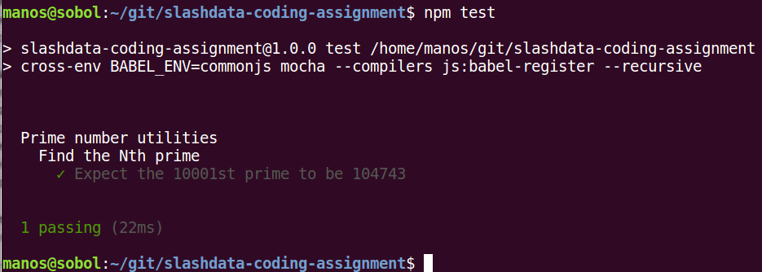

# slashdata-coding-assignment
Coding Assignment - Prime Numbers

## Code Assignment

> By listing the first six prime numbers: 2, 3, 5, 7, 11 and 13, 
> we can see that the 6th prime is 13. What is the 10 001st prime number?

The number is `104743`. The source code is at [app/nthprime.js](app/nthprime.js) 
and the test is at [test/nthprime.js](test/nthprime.js). This project took about 
30 minutes and uses simple trial division. If time permitted a superior 
implementation, that could be based on the [sieve of Eratosthenes](https://en.wikipedia.org/wiki/Sieve_of_Eratosthenes) 
or the the [Meissel-Lehmer algorithm](https://en.wikipedia.org/wiki/Meissel%E2%80%93Lehmer_algorithm).   

Steps to checkout and run the tests locally:

1. Ensure you have **git** and **npm** installed properly
2. Check out this repo with: `git clone https://github.com/manosbatsis/slashdata-coding-assignment.git`
3. Install with NPM (you may need sudo): `npm install`
4. Run the test: `npm test`

Here is the result:

## Short Written Questions

> 1. When would you choose a NoSQL database instead of a relational database and why?

According to project requirements. RDBMS systems address needs like [ACID](https://en.wikipedia.org/wiki/ACID) 
or [nested transactions](https://en.wikipedia.org/wiki/ACID). Various NoSQL solutions available differ greatly 
in their features, limitations target problem spaces. Some like [MongoDB](https://www.mongodb.com/) provide 
flexible and even schema-less, document-based storage but have limited 
(e.g. per document) transactions support. [ElasticSearch](https://www.elastic.co/) provides scalable 
fulltext search capabilities. [Cassandra](http://cassandra.apache.org/) provides a distributed, “eventually consistent” 
and "always available" database. Others may be suitable for graph or key-value pair data. The list goes on and on.

So, in short, I would choose a NoSQL database in cases it could be the right tool for the task at hand.

> 2. If you have problems with the performance of SQL queries on data that changes very
infrequently, what options are there for improving the performance?

It really depends on the RDBMS used, the size of infrequently changed data, and architecture of the application issuing 
the queries, A common example would be some level of caching, e.g. second level cache in Hibernate's implementation JPA.

> 3. What are the most important things to consider when designing a web application that has to
work well on mobile devices?

Off the top of one's head, the list would include:

- Overall compatibility
- Responsive layout
- Limited hardware resources
- Size of resources in HTTP (or other) traffic
- Off-line use (e.g. using local browser storage temporarily)

> 4. What would you consider an effective development process and collaboration tools for a small
remote team of 3 or 4 developers?

It depends on the circumstances involved. Development methodologies are more critical to larger teams,  
so in this case a decision could be based on project/client requirements and the team members themselves. 

Overall I tend to align with the goals of the agile manifesto without necessarily applying an agile, SCRUM etc. 
methodology per se. Having distinct roles of a product owner and team lead is important, as well as 
efficiently utilizing limited development resources properly through TDD, CI etc.   
